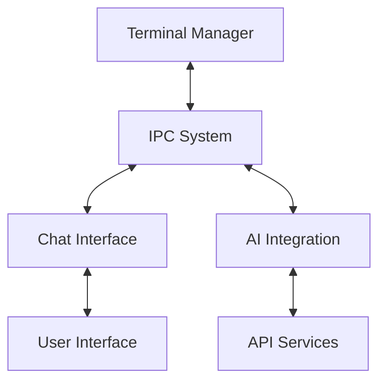

# System Architecture

## Core Components

### 1. Terminal Manager

The Terminal Manager is responsible for handling all terminal-related operations.

#### Components
- **Session Handler**: Manages terminal session (tmate or custom PTY)
- **Output Capture**: Captures and processes terminal output
- **Command Executor**: Handles command execution with safety checks
- **State Manager**: Maintains terminal state and history

#### Key Responsibilities
- Terminal session initialization and management
- Real-time output capture and processing
- Safe command execution with proper isolation
- Terminal state preservation and restoration

### 2. Chat Interface

The chat interface provides the user interaction layer for AI communication.

#### Components
- **Message Handler**: Manages chat history and message threading
- **Command Approval UI**: Interface for reviewing and approving AI commands
- **Settings Manager**: Handles system prompt and API configuration
- **Context Viewer**: Displays current AI context and terminal state

#### Key Responsibilities
- Real-time chat interaction with AI
- Command approval workflow management
- System prompt configuration
- API settings management

### 3. AI Integration Layer

Handles all AI-related functionality and API interactions.

#### Components
- **API Client Manager**: Manages multiple API integrations
- **Context Manager**: Maintains and updates AI context
- **Response Processor**: Processes AI responses and extracts commands
- **Prompt Manager**: Handles system prompt and instruction management

#### Key Responsibilities
- API client initialization and management
- Context building and maintenance
- Response parsing and command extraction
- Error handling and retry logic

### 4. IPC System

Manages communication between terminal and chat components.

#### Components
- **Message Bus**: Handles inter-process message routing
- **State Sync**: Maintains synchronized state across components
- **Event System**: Manages system-wide events and notifications
- **Protocol Handler**: Implements communication protocols

#### Key Responsibilities
- Bi-directional communication management
- State synchronization
- Event distribution
- Error handling and recovery

## System Integration

### Data Flow

1. Terminal Output Flow
```
Terminal → Output Capture → Context Manager → AI Context → Chat Display
```

2. Command Execution Flow
```
AI Response → Command Extractor → Approval System → Command Executor → Terminal
```

3. Context Update Flow
```
Terminal State → State Manager → Context Manager → AI Context
```

### Component Interaction



## Technical Considerations

### Terminal Integration Options

1. Tmate Approach
- Leverages existing session sharing
- Built-in security features
- Requires additional output capture layer

2. Custom PTY Approach
- Full control over IO
- Direct integration capabilities
- More complex implementation

### State Management

1. Terminal State
- Command history
- Environment variables
- Working directory
- Process tree

2. Chat State
- Message history
- Approval settings
- System prompt
- API configuration

### Error Handling

1. Terminal Errors
- Session disconnection
- Command execution failures
- Permission issues

2. AI Errors
- API failures
- Rate limiting
- Context overflow

3. IPC Errors
- Communication failures
- State synchronization issues
- Component crashes

## Performance Considerations

### Optimization Points

1. Terminal Output Processing
- Buffering strategies
- Output filtering
- Rate limiting

2. Context Management
- Context window optimization
- State compression
- Memory management

3. IPC Communication
- Message batching
- State diff updates
- Event prioritization
